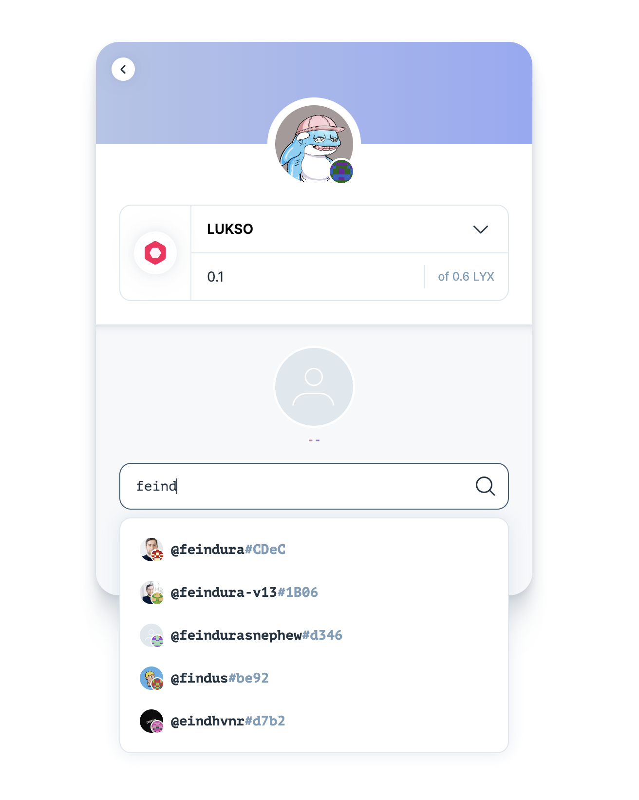

# API Keys

We provide a few API keys and endpoints for you to quickly onboard the LUKSO ecosystem.

## [Algolia](https://www.algolia.com/)


<p align="center">

</p>

Our backend system indexes profiles and assets and sends the data to Algolia.

You can use the following Algolia API key to build a quick search engine for Universal Profiles and/or assets (as seen on the screenshot above). This is the technology that powers the search bar on <https://universalprofile.cloud/>.


```
APPLICATION_ID = YHFN1WRCR5
API_KEY = 6cd4b6c9ff7981882167328fd304dc83
```

**Indices:**

- `prod_mainnet_assets`
- `prod_testnet_assets`
- `prod_mainnet_universal_profiles`
- `prod_testnet_universal_profiles`

**ACLs:**

- `search`
- `browse`

Note: this shared API key has a limit of 100000 API calls/IP/hour and will probably be deleted after the hackathon. If you wish to use it after the hackathon, please contact us on Discord, using the [dev-chat](https://discord.gg/lukso) channel under [DEVELOPERS].

### Resources

- [Algolia Docs](https://www.algolia.com/doc/)

## LUKSO API

We provide the following API to help you get the nice information about the profiles and assets:

```
https://api.universalprofile.cloud/
```

### `GET /v1/:chainId/address/:address`

Return [LSP4 - Digital Asset Metadata](https://docs.lukso.tech/standards/tokens/LSP4-Digital-Asset-Metadata/) or [LSP3 - Profile Metadata](https://docs.lukso.tech/standards/universal-profile/lsp3-profile-metadata). Loads data directly from Algolia and caches it for a while. Adding /TOKENID at the end will retrieve tokenId data for LSP8 tokens.

### `GET /v1/:chainId/stats`

Get statistics of profile and asset indexes for the particular chain.

### `GET /ipfs/:cid*`

Return content from IPFS gateways.
