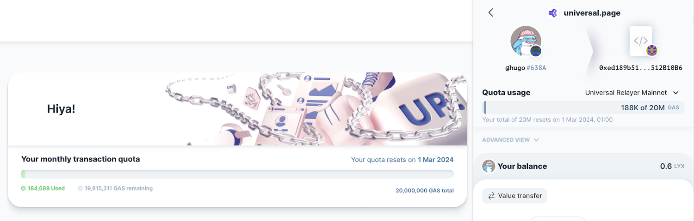

# ⛽️ Build a Transaction Relay Service

This bounty seeks to reward the best project tackling Transaction Relay Services using innovative and self-sustainable business models.

## 💰 Prizes

- 🥇 1st Place 6,000 USDC
- 🥈 2nd Place 4,000 USDC
- 🥉 3rd Place 1,500 USDC
- 🎖️ 4th place 1,000 USDC

## Getting started

LUKSO is an EVM-based blockchain, so everything works the same as for other EVM chains. The main difference is that users use smart accounts (Universal Profiles) through our [UP Browser Extension](https://chrome.google.com/webstore/detail/universal-profiles/abpickdkkbnbcoepogfhkhennhfhehfn) to interact with your dApp: this unlocks a lot of great possibilities ✨

One of them is that it is possible to have gasless transactions through the use of "Transaction Relay Services".

By using the LUKSO UP Browser Extension, you can experiment with this great feature by yourself.

To get started we recommend you to:

1. Download the extension and create a Universal Profile 👉 <https://my.universalprofile.cloud/>.
2. Interact with LUKSO dApps such as:
   - [LUKSO Universal Profile management dApp](https://my.universalprofile.cloud/).
   - [LUKSO Wallet](https://wallet.universalprofile.cloud/) ([Nuxt.js codebase](https://github.com/lukso-network/wallet.universalprofile.cloud)) - a wallet application that allows users to see the Tokens (LSP7) and NFTs (LSP8) associated to a specific LUKSO's Universal Profile address.
   - [Universal Page](https://universal.page/) - a marketplace for assets on LUKSO and profile management dApp.
3. Look at the [Relayer API](https://docs.lukso.tech/standards/relayer-api) endpoints.
4. Check the [Mock Transaction Relayer](https://github.com/lukso-network/tools-mock-relayer) code repository.

Good luck and happy hacking 🧙

## Resources

- 📂 [LUKSO Technical Documentation](https://docs.lukso.tech/)
- [Tips and tricks for (Web3?) hackathons](https://hugomasclet.com/tips-tricks-web3-hackathons)
- ⛓️ LUKSO Network parameters [mainnet](https://docs.lukso.tech/networks/testnet/parameters) / [testnet](https://docs.lukso.tech/networks/testnet/parameters)
- 🛠️ Discover the LUKSO [Tools](https://docs.lukso.tech/tools/getting-started) such as ERC725Tools, erc725.js, etc.
- 🎥 [Previous Hackathon Video Resources](https://www.youtube.com/playlist?list=PLNzyUdu4v7bkwBuDV0gSJrrniPsx5bxK_) in video format
